# 🏗️ RAG Microservice - Architecture & Dataflow Diagrams

## 📊 System Architecture Overview

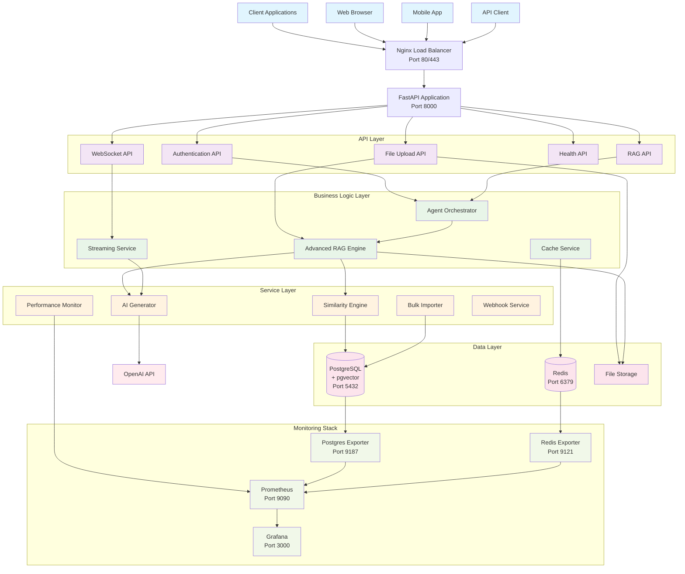

## 🔄 Detailed Data Flow Diagram

### 1. Document Ingestion Flow

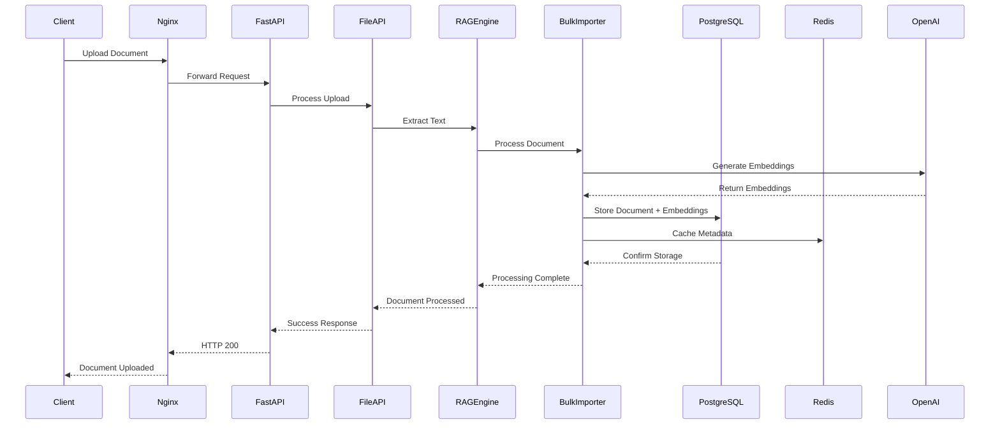

### 2. Query Processing Flow

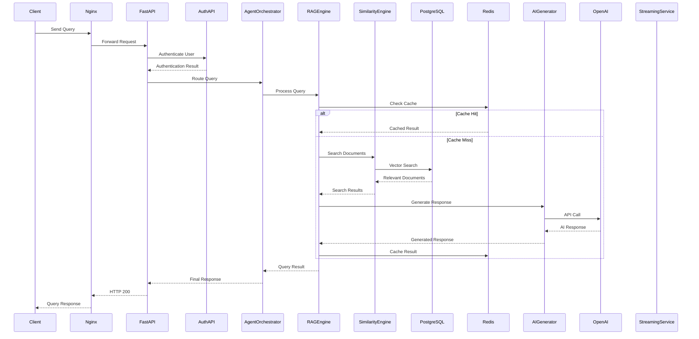

### 3. Real-time Streaming Flow

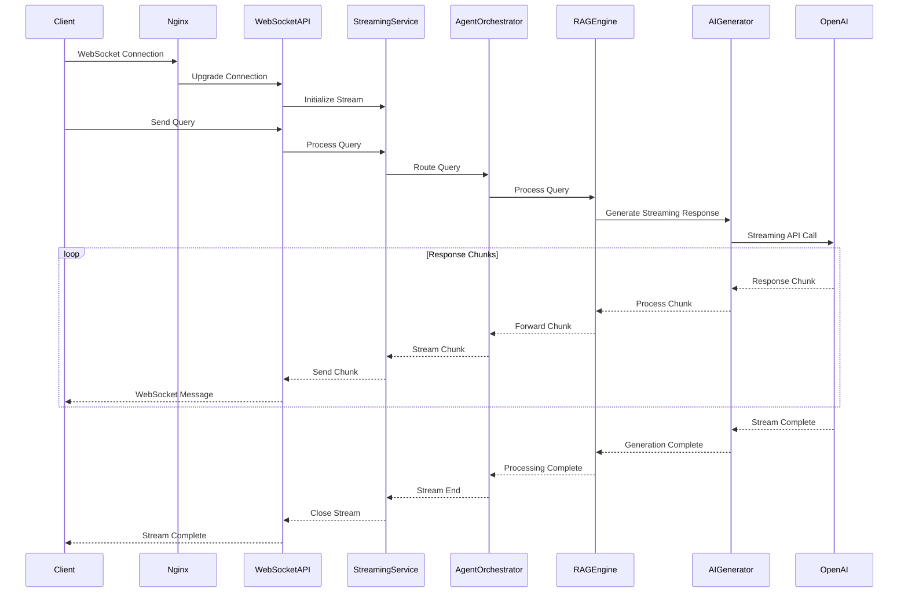

### 4. Multi-Agent Orchestration Flow

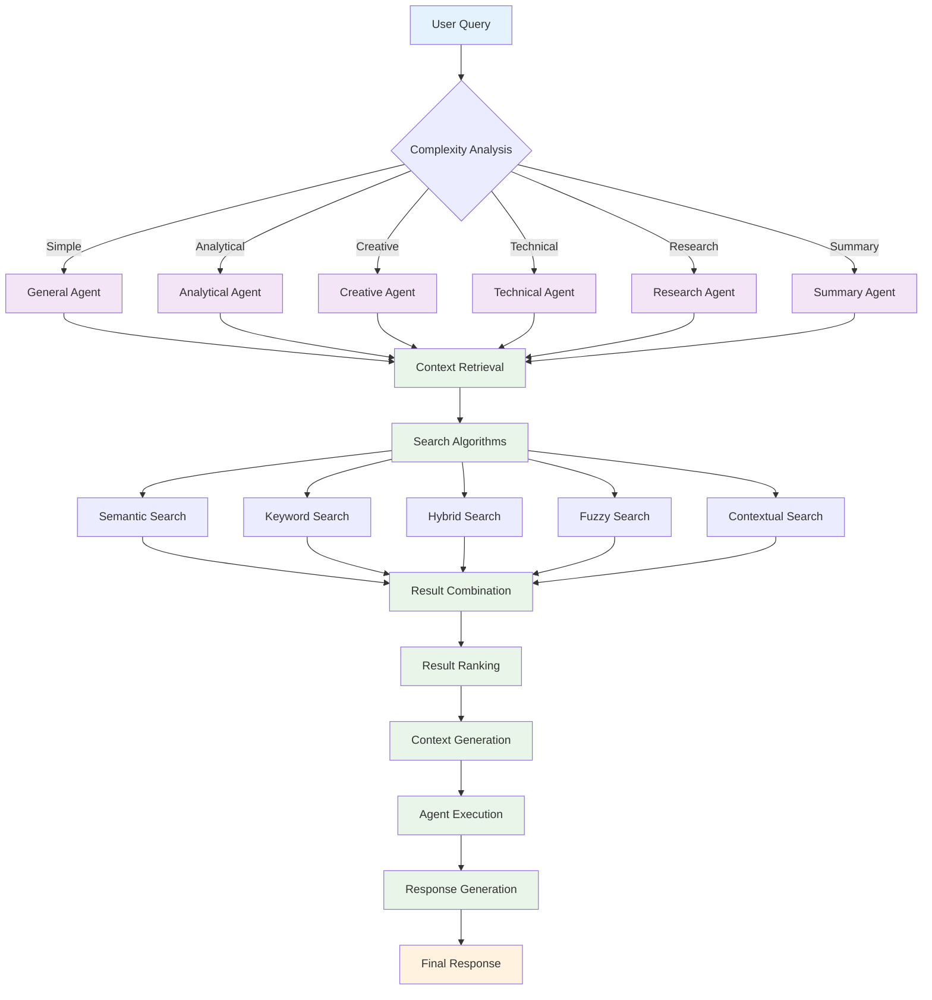

## 🏛️ Component Architecture Details

### 1. API Layer Components

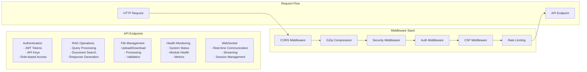

### 2. Business Logic Layer

```mermaid
graph TB
    subgraph "Agent Orchestrator"
        QueryAnalyzer[Query Analyzer<br/>- Complexity Assessment<br/>- Intent Detection<br/>- Agent Selection]
        AgentCoordinator[Agent Coordinator<br/>- Parallel Execution<br/>- Result Synthesis<br/>- Error Handling]
        AgentRegistry[Agent Registry<br/>- Agent Discovery<br/>- Capability Mapping<br/>- Load Balancing]
    end
    
    subgraph "RAG Engine"
        SearchOrchestrator[Search Orchestrator<br/>- Algorithm Selection<br/>- Parallel Search<br/>- Result Combination]
        ContextBuilder[Context Builder<br/>- Document Assembly<br/>- Relevance Scoring<br/>- Context Optimization]
        ResponseGenerator[Response Generator<br/>- Template Selection<br/>- Content Assembly<br/>- Quality Assurance]
    end
    
    subgraph "Streaming Service"
        StreamManager[Stream Manager<br/>- Connection Management<br/>- Event Routing<br/>- Resource Cleanup]
        ChunkProcessor[Chunk Processor<br/>- Content Chunking<br/>- Format Conversion<br/>- Delivery Optimization]
        SessionHandler[Session Handler<br/>- Session State<br/>- User Context<br/>- History Management]
    end
    
    QueryAnalyzer --> AgentCoordinator
    AgentCoordinator --> AgentRegistry
    SearchOrchestrator --> ContextBuilder
    ContextBuilder --> ResponseGenerator
    StreamManager --> ChunkProcessor
    ChunkProcessor --> SessionHandler
```

### 3. Data Layer Architecture

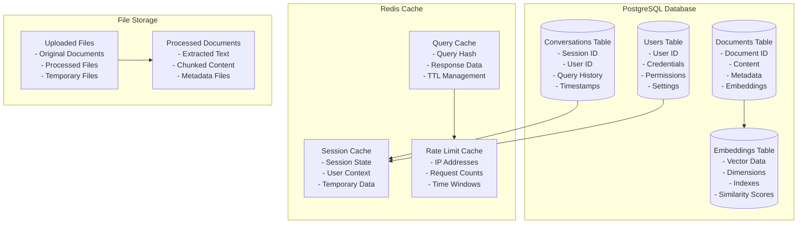

### 4. Monitoring & Observability

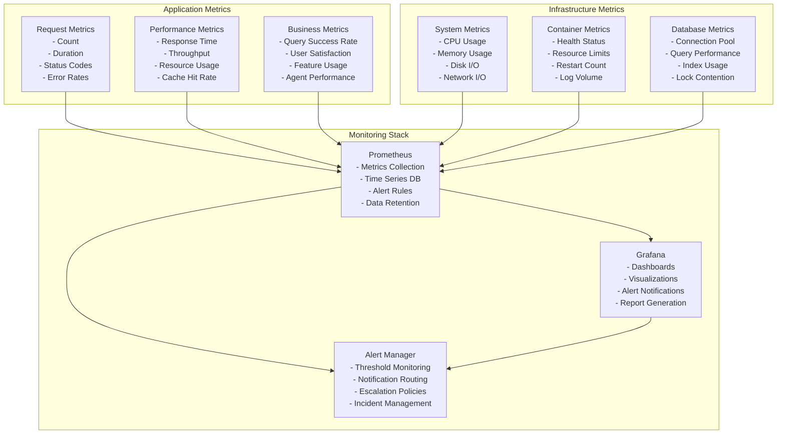

## 🔧 Deployment Architecture

### 1. Docker Container Architecture

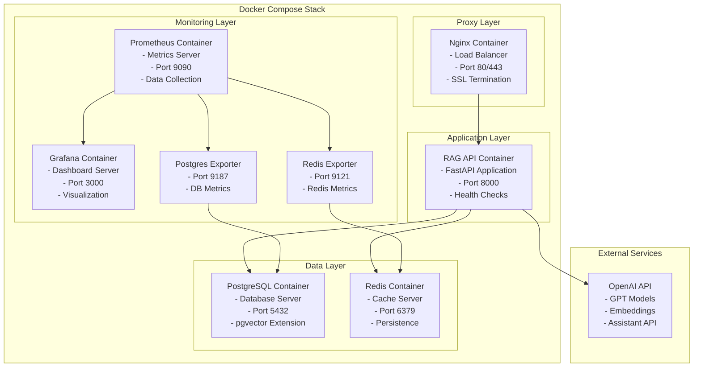

### 2. Network Architecture

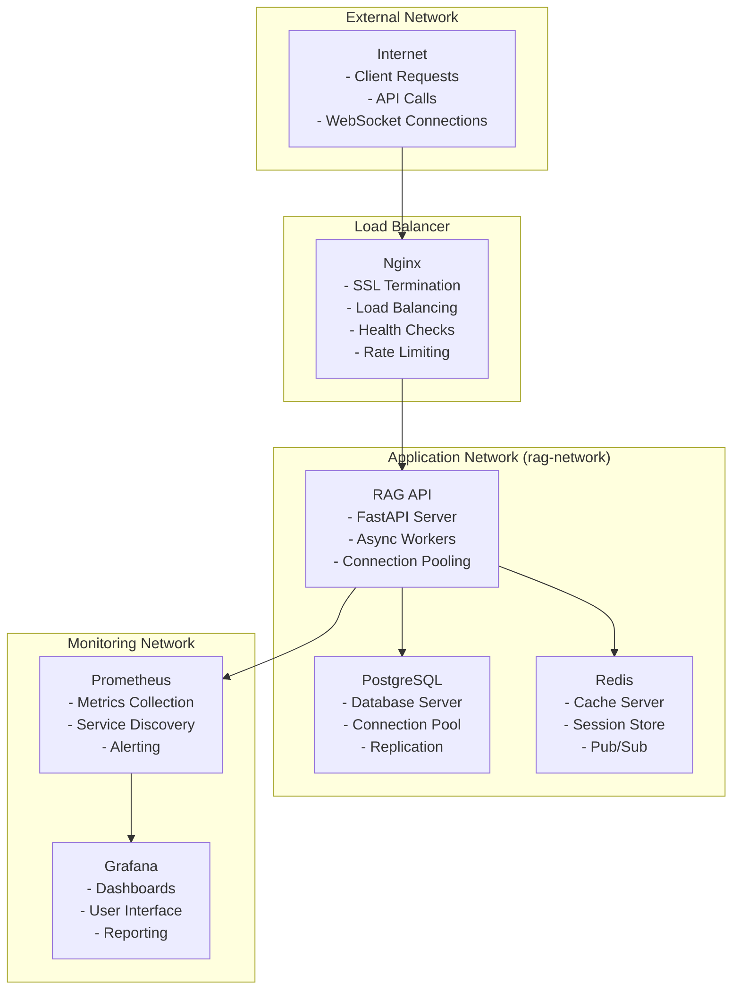

## 🔒 Security Architecture

### 1. Security Layers

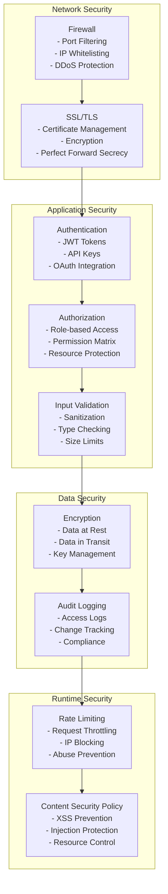

## 📈 Performance Architecture

### 1. Caching Strategy

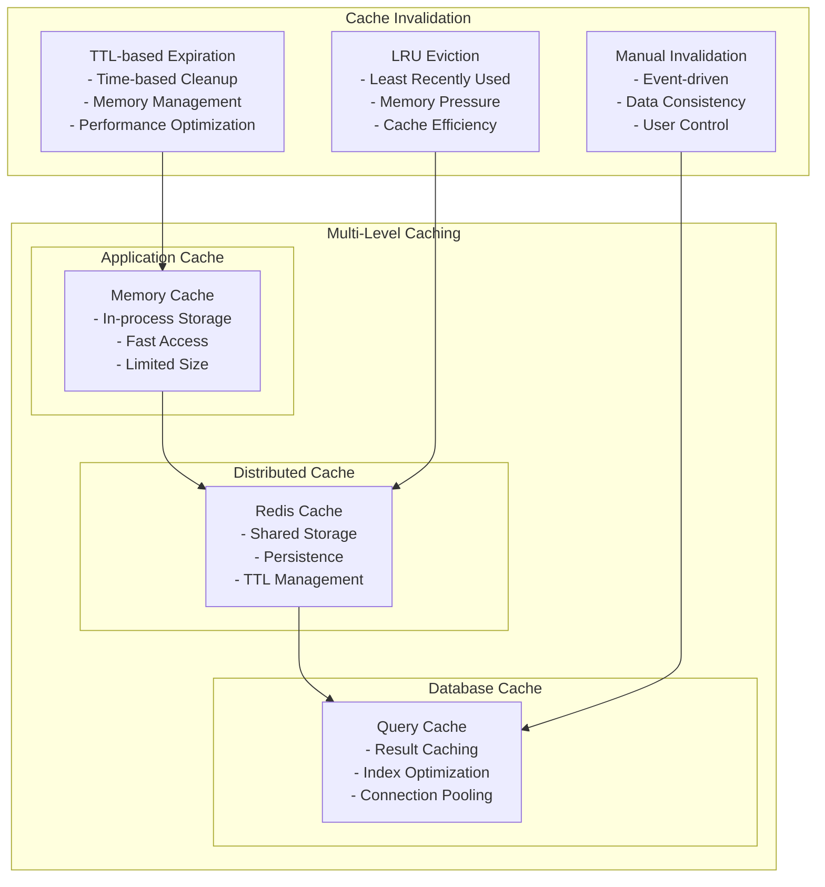

### 2. Scalability Patterns

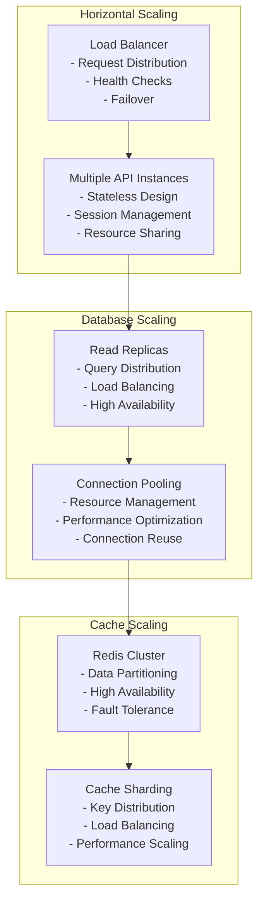

## 🚀 Future Architecture Evolution

### 1. Microservices Split

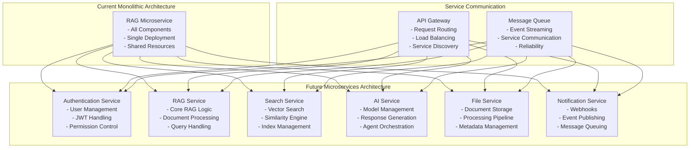

This comprehensive architecture and dataflow documentation provides a complete view of the RAG Microservice system, including:

1. **System Architecture Overview**: High-level component relationships
2. **Detailed Data Flow Diagrams**: Step-by-step process flows
3. **Component Architecture**: Detailed breakdown of each layer
4. **Deployment Architecture**: Container and network setup
5. **Security Architecture**: Multi-layered security approach
6. **Performance Architecture**: Caching and scaling strategies
7. **Future Evolution**: Planned architectural improvements

The diagrams use Mermaid syntax and can be rendered in any Markdown viewer that supports Mermaid diagrams, providing a visual understanding of the complete system architecture and data flows. 