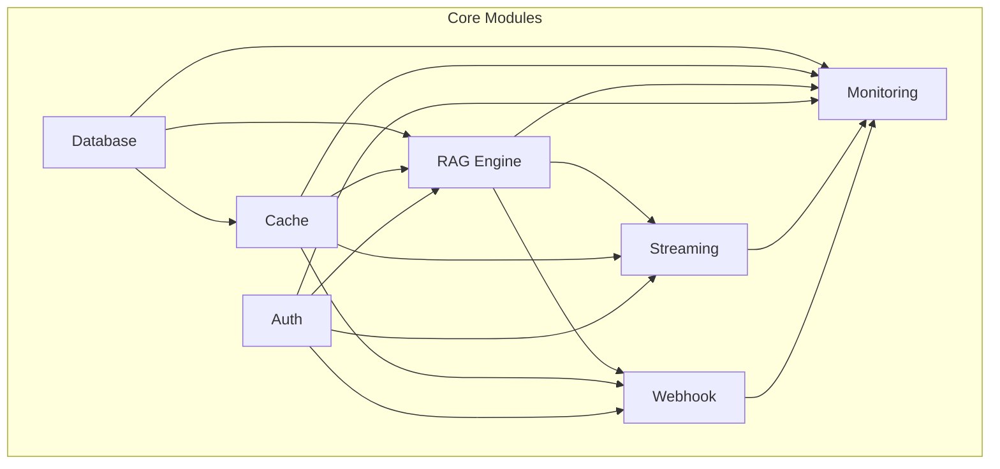

# 🏗️ Modular Architecture Guide

## Overview

This project uses a **modular architecture** for maintainability, scalability, and testability. Each major concern (database, cache, RAG, authentication, streaming, webhook, monitoring) is implemented as a separate module with its own lifecycle, configuration, and health checks.

---

## Why Modular?
- **Separation of Concerns**: Each module handles a single responsibility.
- **Easy Testing**: Modules can be tested in isolation.
- **Scalability**: Add, remove, or update modules independently.
- **Reliability**: Errors are isolated to individual modules.
- **Observability**: Each module provides health and status info.

---

## Module System at a Glance



---

## Module Directory Structure

```
app/
  modules/
    database.py      # Database operations
    cache.py         # Caching operations
    rag.py           # RAG operations
    auth.py          # Authentication
    streaming.py     # Streaming (WebSocket/SSE)
    webhook.py       # Webhook operations
    monitoring.py    # Monitoring and health
```

---

## How Modules Work
- All modules inherit from `BaseModule` (see `app/core/modules.py`).
- Modules are registered and managed by the `ModuleRegistry`.
- Each module has its own config, dependencies, and health check.
- Modules are initialized in dependency order and shut down in reverse.

### Example: Minimal Module
```python
from app.core.modules import BaseModule, ModuleConfig

class ExampleModule(BaseModule):
    async def initialize(self):
        # Setup logic here
        pass
    async def shutdown(self):
        # Cleanup logic here
        pass
    async def health_check(self):
        return {"status": "ok"}
```

---

## Module Lifecycle
1. **Registration**: All modules are registered with the registry.
2. **Dependency Resolution**: Modules are sorted by dependencies.
3. **Initialization**: Modules are initialized in order.
4. **Health Check**: Each module provides health info.
5. **Shutdown**: Modules are shut down in reverse order.

---

## Adding a New Module
1. Create a new file in `app/modules/` (e.g., `my_module.py`).
2. Inherit from `BaseModule` and implement `initialize`, `shutdown`, and `health_check`.
3. Register your module in the registry (see `app/core/module_registry_setup.py`).
4. Add any dependencies in your module's config.

---

## Module Health & Monitoring
- Each module implements a `health_check` method.
- The API exposes `/health/modules` for per-module status.
- Monitoring module aggregates and reports health for all modules.

---

## Best Practices
- Keep modules focused: one responsibility per module.
- Use clear, explicit dependencies.
- Provide meaningful health checks.
- Use module config for all settings (avoid hardcoding).
- Test modules in isolation when possible.

---

## Troubleshooting
- If a module fails to initialize, check its config and dependencies.
- Use `/health/modules` to see which module is unhealthy.
- Logs for each module are prefixed with the module name for easy filtering.

---

## Further Reading
- See [`ARCHITECTURE_SUMMARY.md`](ARCHITECTURE_SUMMARY.md) for a full system overview.
- See `app/core/modules.py` for the base module system.
- See `app/core/module_registry_setup.py` for registration logic. 